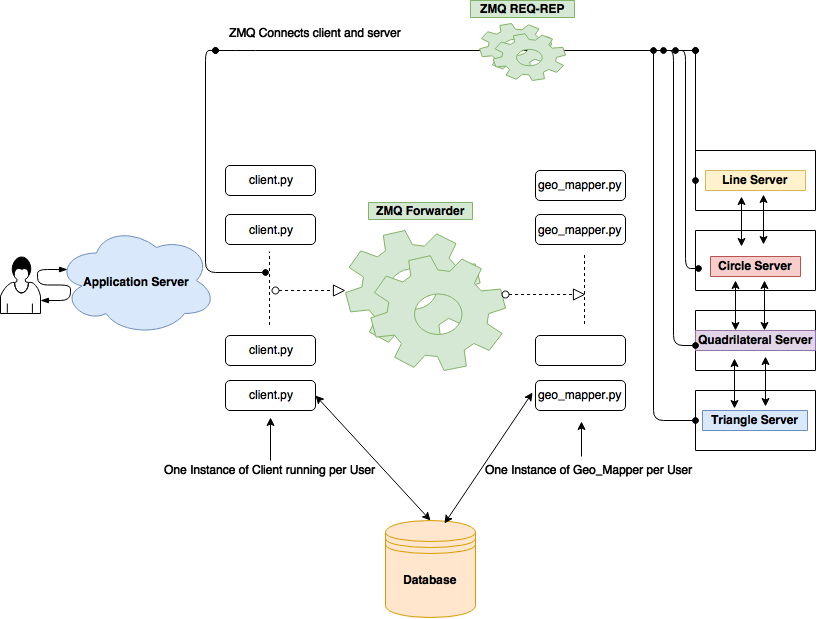

# machine-learning


Testing the process involved in machine learning.
## How to trial run - 
```
1. virtualenv env
2. bash start_server.sh
```
Go to the  displayed address and start typing the commands.

